# فصل ۴: پیاده‌سازی، آزمایش و ارزیابی سامانه پایش بلادرنگ ECG

## ۴-۱ مقدمه

در این فصل پیاده‌سازی عملی سامانه پایش بلادرنگ ECG شرح داده می‌شود. هدف از این پیاده‌سازی، ساخت یک زنجیره کامل و قابل اجرا برای دریافت سیگنال ECG تک‌لید، انتقال داده به کامپیوتر، فیلترگذاری دیجیتال، تشخیص قله R، تخمین نقاط P/Q/R/S/T، استخراج ویژگی‌های زمانی، ارزیابی کیفیت سیگنال، نمایش بلادرنگ، اجرای سناریوهای آزمایشی و تولید گزارش خودکار است.

سامانه حاضر یک نمونه آموزشی و پژوهشی است و برای تشخیص پزشکی، تصمیم‌گیری درمانی یا پایش اضطراری طراحی نشده است. به همین دلیل در تمام بخش‌های نرم‌افزار، خروجی‌ها با عنوان‌هایی مانند «هشدار اولیه»، «وضعیت ممکن»، «تحلیل غیرتشخیصی» و «کیفیت سیگنال» بیان می‌شوند. هدف اصلی پروژه این است که نشان دهد چگونه می‌توان با سخت‌افزار کم‌هزینه و پردازش کامپیوتری، یک pipeline مهندسی برای تحلیل اولیه ECG ساخت و همزمان محدودیت‌ها، خطاها و موارد غیرقابل اعتماد را نیز به‌صورت شفاف گزارش کرد.

معماری کلی سامانه در شکل ۴-۱ نشان داده شده است. داده از الکترودها و ماژول AD8232 آغاز می‌شود، Arduino فقط نمونه‌برداری و ارسال داده را انجام می‌دهد، و پردازش اصلی در Python انجام می‌شود.

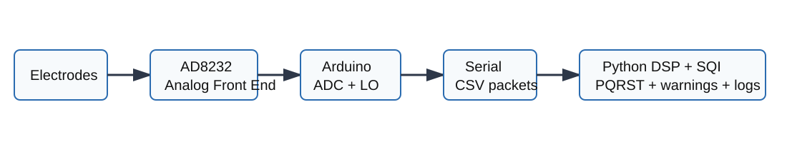

## ۴-۲ محدوده ایمنی و غیرتشخیصی بودن سامانه

از آنجا که ECG یک سیگنال زیستی حساس است، تعیین محدوده کاربرد سامانه بخش مهمی از پیاده‌سازی محسوب می‌شود. در این پروژه سه اصل رعایت شده است:

1. سامانه medical device نیست و خروجی آن نباید به‌عنوان diagnosis تفسیر شود.
2. هشدارها rule-based و مقدماتی هستند و فقط برای نمایش رفتار الگوریتم استفاده می‌شوند.
3. اگر کیفیت سیگنال پایین باشد، تحلیل rhythm و morphology محدود یا suppress می‌شود.

در رابط کاربری و گزارش‌ها عبارت «Educational prototype - not a medical device» نمایش داده می‌شود. همچنین پیام‌هایی مانند «Poor signal - analysis suppressed»، «Possible irregular RR» و «Preliminary high-rate warning» جایگزین عبارت‌های تشخیصی قطعی می‌شوند. بنابراین سیستم به‌جای اینکه بیماری را اعلام کند، وضعیت قابل مشاهده در سیگنال و سطح اعتماد تحلیل را گزارش می‌دهد.

## ۴-۳ پیاده‌سازی سخت‌افزار

در بخش سخت‌افزار از ماژول AD8232 به‌عنوان analog front end استفاده شد. این ماژول سیگنال ECG تک‌لید را از الکترودها دریافت کرده، آن را تقویت و آماده‌سازی اولیه می‌کند و خروجی آنالوگ مناسب برای خواندن توسط ADC برد Arduino تولید می‌کند. AD8232 همچنین دو خروجی lead-off با نام‌های `LO+` و `LO-` دارد که جدا شدن یا اتصال نامناسب الکترودها را نشان می‌دهند.

برد Arduino در این پروژه فقط واحد acquisition است. این تصمیم به دلیل محدودیت حافظه، توان پردازشی و امکانات نمایش Arduino اتخاذ شد. تمام پردازش‌های اصلی، شامل فیلترگذاری، تشخیص QRS، تخمین PQRST، SQI، هشدارها، GUI و گزارش‌گیری، روی کامپیوتر انجام می‌شوند.

جدول ۴-۱ اتصال سخت‌افزار را نشان می‌دهد.

| پایه AD8232 | پایه Arduino | نقش |
|---|---|---|
| OUTPUT | A5 | ورودی آنالوگ ECG در sketch نهایی |
| LO+ | D3 | تشخیص جدا شدن الکترود مثبت |
| LO- | D2 | تشخیص جدا شدن الکترود منفی |
| VCC | 3.3V در ثبت نهایی | تغذیه ماژول AD8232 |
| GND | GND | زمین مشترک |

نرخ نمونه‌برداری پیش‌فرض sketch برابر ۲۵۰ Hz است. این نرخ برای نمایش و تحلیل آموزشی ECG تک‌لید مناسب است و با QT Database نیز هم‌خوانی دارد. ارزیابی MIT-BIH با نرخ نمونه‌برداری خود دیتاست یعنی ۳۶۰ Hz انجام می‌شود.

در کابل سه‌الکتروده AD8232، جای‌گذاری رایج آموزشی مطابق برچسب‌های RA، LA و RL انجام می‌شود. RA و LA اختلاف پتانسیل اصلی ECG تک‌لید را می‌سازند و RL به‌عنوان الکترود مرجع/drive برای کاهش نویز مشترک استفاده می‌شود. در ثبت واقعی این پروژه، قرارگیری الکترودها و اتصال سیم‌ها مطابق شکل‌های ۴-۲ و ۴-۳ کنترل شد. این شکل‌ها فقط برای مستندسازی setup آموزشی هستند و جایگزین دستورالعمل پزشکی یا تجهیزات ایزوله استاندارد نمی‌شوند.

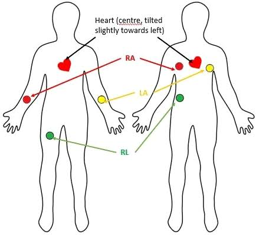

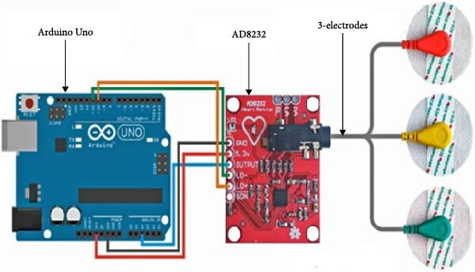

## ۴-۴ برنامه Arduino و قالب packet

برنامه Arduino در مسیر `arduino/ad8232_sampler/ad8232_sampler.ino` قرار دارد. این sketch با استفاده از `micros()` و بدون `delay()` زمان‌بندی نمونه‌برداری را انجام می‌دهد تا نرخ نمونه‌برداری پایدارتر باشد. در هر نمونه، مقدار ADC، وضعیت lead-off، شماره نمونه، timestamp و checksum ارسال می‌شود.

قالب packet فعلی به‌صورت زیر است:

```text
S,<seq>,<micros>,<adc>,<lo_plus>,<lo_minus>,<checksum>
```

جدول ۴-۲ معنی فیلدها را نشان می‌دهد.

| فیلد | توضیح |
|---|---|
| `S` | نشانگر شروع packet |
| `seq` | شماره افزایشی نمونه برای تشخیص packet loss |
| `micros` | زمان نمونه‌برداری بر حسب میکروثانیه |
| `adc` | مقدار خام ADC بین ۰ تا ۱۰۲۳ |
| `lo_plus` | وضعیت پایه LO+ |
| `lo_minus` | وضعیت پایه LO- |
| `checksum` | checksum نوع XOR برای تشخیص packet corruption |

شکل ۴-۴ قالب packet را نشان می‌دهد.

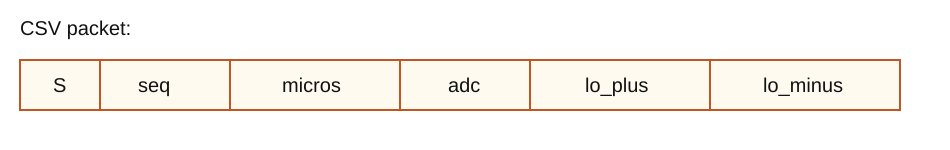

برای سازگاری با نسخه‌های قبلی، parser سمت Python همچنان قالب‌های قدیمی `S,seq,micros,adc,lo_plus,lo_minus` و `timestamp,adc,lead_off` را نیز می‌پذیرد. checksum یک لایه افزوده برای نسخه نهایی است تا علاوه بر افت نمونه، packet خراب نیز قابل تشخیص باشد.

## ۴-۵ parser سریال و معیارهای real-time

ماژول `ecg_monitor/serial_reader.py` وظیفه parse کردن packetها و محاسبه معیارهای ارتباطی را بر عهده دارد. این ماژول داده‌های معتبر را به ساختار `SerialSample` تبدیل می‌کند و packetهای خراب را بدون crash شدن برنامه رد می‌کند.

معیارهای real-time محاسبه‌شده عبارت‌اند از:

- تعداد کل lineهای دریافت‌شده؛
- تعداد نمونه‌های معتبر؛
- تعداد packetهای malformed؛
- تعداد checksum error؛
- تعداد packetهای افتاده از روی gap در `seq`؛
- نرخ packet loss؛
- نرخ نمونه‌برداری تخمینی از روی timestampها؛
- میانگین فاصله زمانی بین نمونه‌ها؛
- jitter زمانی؛
- تعداد نمونه‌های دارای lead-off.

این معیارها برای پایان‌نامه مهم‌اند، زیرا نشان می‌دهند سامانه فقط waveform را نمایش نمی‌دهد، بلکه کیفیت acquisition و ارتباط سریال را نیز اندازه‌گیری می‌کند.

## ۴-۶ معماری نرم‌افزار Python

معماری نرم‌افزار Python به‌صورت ماژولار طراحی شد تا هر بخش قابل تست و ارزیابی مستقل باشد. شکل ۴-۵ مسیر نرم‌افزار را نشان می‌دهد.

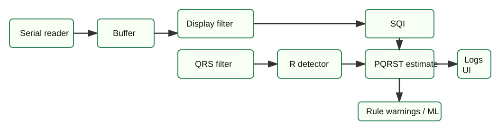

مهم‌ترین ماژول‌ها عبارت‌اند از:

| ماژول | وظیفه |
|---|---|
| `serial_reader.py` | parse packet، packet loss، jitter، checksum |
| `filters.py` | پیش‌پردازش، فیلتر display و فیلتر QRS |
| `detection.py` | تشخیص R و تخمین P/Q/R/S/T |
| `features.py` | استخراج HR، RR، QRS، QT و SQI عددی |
| `sqi.py` | سطح‌بندی کیفیت سیگنال و gating تحلیل |
| `arrhythmia.py` | هشدارهای rule-based غیرتشخیصی |
| `gui.py` | تحلیل پنجره زنده و رابط کاربری PyQtGraph |
| `fiducials.py` | parse و match کردن annotationهای QTDB |
| `mitdb_ml.py` | آزمایش ML اکتشافی روی MIT-BIH |

طراحی ماژولار باعث شد که تست‌های واحد، ارزیابی dataset و GUI همگی از یک pipeline مشترک استفاده کنند. این موضوع احتمال تفاوت بین نتایج offline و رفتار live را کاهش می‌دهد.

## ۴-۷ فیلترگذاری دیجیتال و تفکیک شاخه QRS از morphology

در ECG، فیلتر مناسب برای تشخیص QRS الزاماً فیلتر مناسب برای حفظ شکل P و T نیست. به همین دلیل دو شاخه فیلترگذاری پیاده‌سازی شد:

1. شاخه display/morphology؛
2. شاخه QRS detection.

در شاخه display، مقدار DC حذف می‌شود و سپس فیلترهای بالاگذر و پایین‌گذر برای کاهش baseline wander و نویز فرکانس بالا اعمال می‌شوند. notch 50 Hz نیز برای کاهش تداخل برق شهر در نظر گرفته شده است.

در شاخه QRS، سیگنال با باند تقریبی ۵ تا ۱۵ Hz فیلتر می‌شود تا انرژی QRS برجسته شود. این شاخه برای تشخیص R مناسب است، اما برای تخمین P و T به‌تنهایی استفاده نمی‌شود.

شکل ۴-۶ روند تشخیص QRS را نشان می‌دهد.

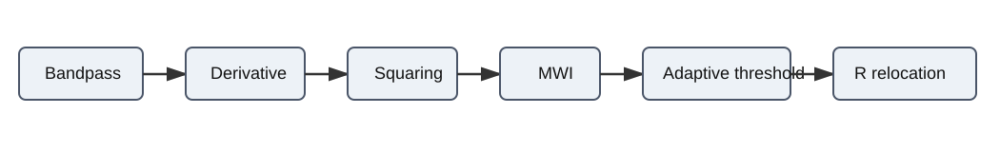

همچنین نمودار تولیدشده در `results/figures/raw_vs_filtered_branches.png` تفاوت شاخه خام، شاخه morphology و شاخه QRS را نشان می‌دهد.

## ۴-۸ تشخیص QRS و قله R

تشخیص R در `ecg_monitor/detection.py` با یک pipeline قابل توضیح از خانواده Pan-Tompkins/Hamilton انجام می‌شود. مراحل اصلی عبارت‌اند از:

1. فیلتر باندگذر QRS؛
2. مشتق‌گیری؛
3. توان دوم‌گیری؛
4. moving average با پنجره حدود ۱۵۰ ms؛
5. آستانه‌گذاری adaptive با median و MAD؛
6. اعمال refractory period حدود ۲۲۰ ms؛
7. هم‌ترازسازی قله روی بیشینه یا کمینه واقعی سیگنال خام؛
8. حذف double detectionهای محتمل ناشی از T-wave.

در نسخه‌های اولیه، مشکل اصلی MIT-BIH بالا بودن false positive بود، نه sensitivity. بررسی record-by-record نشان داد که در چند رکورد، الگوریتم پس از R واقعی یک قله کم‌دامنه و کوتاه‌فاصله را نیز به‌عنوان R می‌پذیرد. این الگو با T-wave double detection سازگار بود. برای کاهش این خطا، یک مرحله post-processing اضافه شد که اگر یک candidate بعد از R قبلی در فاصله کوتاه قرار گیرد، فاصله بعدی طولانی‌تر باشد و prominence نسبی آن نسبت به R قبلی کم باشد، آن candidate حذف می‌شود.

این تغییر باعث شد PPV در ارزیابی ۴۸ رکورد MIT-BIH از حدود ۹۲٫۹۳٪ به ۹۸٫۵۵٪ برسد، در حالی که sensitivity تقریباً ثابت باقی ماند.

## ۴-۹ تخمین نقاط P/Q/R/S/T

پس از تشخیص R، برای هر ضربان پنجره‌های زمانی اطراف R تعریف می‌شود. Q و S به‌عنوان کمینه‌های محلی نزدیک QRS تخمین زده می‌شوند. P و T به دلیل دامنه کمتر، حساسیت به نویز و تغییرپذیری morphology فقط در صورت مناسب بودن SQI تخمین زده می‌شوند.

در نسخه نهایی، پنجره P و T نسبت به RR interval سازگار می‌شود. این کار باعث می‌شود در ضربان سریع، پنجره T به ضربان بعدی وارد نشود و در ضربان‌هایی که فاصله کافی برای P وجود ندارد، P به‌صورت غیرواقعی گزارش نشود.

جدول ۴-۳ منطق کلی پنجره‌ها را خلاصه می‌کند.

| نقطه | روش تخمین | شرط اعتماد |
|---|---|---|
| R | خروجی QRS detector و peak correction | تحلیل QRS مجاز باشد |
| Q | کمینه محلی قبل از R | پنجره QRS معتبر |
| S | کمینه محلی بعد از R | پنجره QRS معتبر |
| P | بیشینه محلی قبل از QRS | فقط در `usable_for_pqrst` و RR کافی |
| T | بیشینه محلی پس از QRS | فقط در `usable_for_pqrst` |

برای هر marker یک confidence عددی و یک confidence level تولید می‌شود: `high`، `medium`، `low` یا `unavailable`. اگر confidence کمتر از حداقل قابل قبول باشد، marker حذف می‌شود. در GUI و گزارش‌ها، نبودن P یا T به‌عنوان «unavailable» یا «unreliable» پذیرفته می‌شود و با مقدار ساختگی جایگزین نمی‌شود.

نمونه نمودار PQRST در `results/figures/ecg_pqrst_markers.png` تولید شده است.

## ۴-۱۰ استخراج ویژگی‌ها

ماژول `features.py` ویژگی‌های اصلی ECG را از markerها استخراج می‌کند. ویژگی‌های اصلی عبارت‌اند از:

- میانگین ضربان قلب یا HR؛
- فاصله‌های RR؛
- ضریب تغییرات RR؛
- مدت تقریبی QRS؛
- فاصله QT تخمینی در صورت وجود T معتبر؛
- SQI عددی؛
- ویژگی‌های beat-level برای ML، مانند RR قبلی، RR بعدی، HR لحظه‌ای، QRS energy، دامنه R و visibility موج‌های P و T.

این ویژگی‌ها برای سه کاربرد استفاده می‌شوند: نمایش وضعیت در GUI، تولید هشدارهای rule-based و ساخت جدول feature برای ML اکتشافی.

## ۴-۱۱ شاخص کیفیت سیگنال SQI

در این پروژه SQI قبل از warning logic قرار دارد. این تصمیم معماری باعث می‌شود سامانه در شرایطی که سیگنال قابل اعتماد نیست، خروجی rhythm یا morphology را بی‌دلیل گزارش نکند.

SQI در `sqi.py` دو نوع بررسی دارد:

1. hard rejection؛
2. soft confidence.

hard rejection شامل موارد زیر است:

- lead-off فعال؛
- flatline یا near-zero variance؛
- ADC clipping یا saturation؛
- packet loss شدید؛
- timing jitter شدید.

soft confidence از معیارهایی مانند roughness، baseline wander و کیفیت طیفی استفاده می‌کند. خروجی SQI چهار سطح دارد:

| سطح | عنوان انسانی | معنی |
|---|---|---|
| `unreliable` | 0 - Unreliable | تحلیل و هشدار suppress می‌شود |
| `poor` | 1 - Poor | waveform دیده می‌شود ولی برای هشدار قابل اعتماد نیست |
| `usable_for_rate_qrs` | 2 - Usable for HR/QRS | HR و QRS قابل استفاده‌اند، morphology قابل اعتماد نیست |
| `usable_for_pqrst` | 3 - Usable for tentative PQRST | تخمین PQRST با confidence مجاز است |

شکل ۴-۷ منطق gating را نشان می‌دهد.

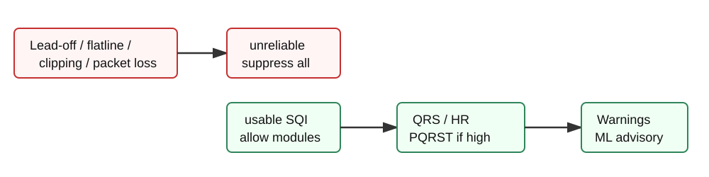

نمودار `results/figures/sqi_timeline_scenarios.png` نشان می‌دهد SQI در گذار از سیگنال تمیز به نویزی، flatline و سپس بازیابی چگونه تغییر می‌کند.

## ۴-۱۲ منطق هشدار rule-based

خروجی هشدارها rule-based است و هیچ تشخیص پزشکی قطعی تولید نمی‌کند. اگر SQI اجازه هشدار ندهد، خروجی rhythm suppress می‌شود. قواعد اصلی عبارت‌اند از:

| ویژگی | شرط | خروجی |
|---|---|---|
| HR کمتر از ۵۰ bpm | ضربان پایین واضح | `Possible bradycardia` |
| HR بین ۵۰ و ۶۰ bpm | ضربان پایین خفیف | `Low heart-rate status` |
| HR بیشتر از ۱۰۰ bpm | ضربان بالا | `Possible tachycardia` |
| RR-CV بیشتر از آستانه | تغییرپذیری RR زیاد | `Irregular RR intervals` |
| RR کوتاه همراه pause | الگوی ضربان زودرس احتمالی | `Premature-beat suspicion` |
| QRS بیشتر از ۱۲۰ ms | فقط در SQI مناسب | `Wide QRS warning` |

برچسب نهایی بر اساس مجموع risk score به سه سطح `Low`, `Moderate` و `High preliminary rhythm warning` تقسیم می‌شود. این سطح‌ها برای نمایش مهندسی خطر نسبی در پروژه هستند و تشخیص بیماری محسوب نمی‌شوند.

## ۴-۱۳ رابط کاربری زنده و حالت‌های اجرا

GUI در `ecg_monitor/gui.py` و `scripts/run_live_gui.py` پیاده‌سازی شده است. اگر PyQtGraph یا Qt نصب نباشد، برنامه پیام نصب نمایش می‌دهد و بدون crash خارج می‌شود. GUI به‌صورت dashboard طراحی شده و فقط یک waveform ساده نیست.

موارد نمایش‌داده‌شده در GUI عبارت‌اند از:

- waveform زنده ECG؛
- markerهای P/Q/R/S/T؛
- HR فعلی؛
- سطح SQI با عنوان انسانی؛
- توضیح SQI؛
- وضعیت lead-off؛
- نرخ packet loss؛
- warning panel؛
- advisory اختیاری ML؛
- mode و scenario فعلی.

سه mode اصلی اجرا وجود دارد:

```bash
.venv/bin/python scripts/run_live_gui.py --mode live --port /dev/cu.usbmodemXXXX
.venv/bin/python scripts/run_live_gui.py --mode replay --replay-wfdb 100 --local-dir data/physionet/mitdb
.venv/bin/python scripts/run_live_gui.py --mode scenario
```

حالت replay برای روز ارائه اهمیت زیادی دارد؛ اگر سخت‌افزار، الکترود یا پورت سریال دچار مشکل شود، می‌توان یک رکورد MIT-BIH یا CSV را مانند سیگنال زنده پخش کرد و markerها، SQI و warningها را نشان داد.

## ۴-۱۴ سناریوهای آزمایشی

برای اعتبارسنجی رفتاری سامانه، اسکریپت `scripts/evaluate_scenario_suite.py` نوشته شد. این اسکریپت هفت سناریوی synthetic را بررسی می‌کند:

| سناریو | انتظار |
|---|---|
| `normal_75` | HR حدود ۷۵ و بدون warning |
| `brady_45` | هشدار اولیه ضربان پایین |
| `tachy_125` | هشدار اولیه ضربان بالا |
| `irregular_rr` | هشدار RR نامنظم |
| `wide_qrs` | هشدار QRS پهن |
| `noisy` | افت SQI و محدود شدن morphology |
| `lead_off` | suppress تحلیل |

نتیجه اجرای نهایی سناریوها در `results/scenario_suite_results.json` ذخیره شده است. هر ۷ سناریو پاس شده‌اند:

| معیار | مقدار |
|---|---:|
| تعداد سناریو | ۷ |
| نرخ پاس کلی | ۱۰۰٪ |
| نرخ پاس HR | ۱۰۰٪ |
| نرخ پاس warning | ۱۰۰٪ |
| میانگین completeness مارکرها | ۹۹٫۰۵٪ |

این سناریوها جایگزین validation بالینی نیستند، اما برای نشان دادن رفتار مهندسی سامانه، demo و regression test مفید هستند.

## ۴-۱۵ تولید گزارش و نمودارهای پایان‌نامه

برای اینکه خروجی پروژه فقط کد نباشد، دو ابزار گزارش‌گیری اضافه شد:

- `scripts/generate_validation_figures.py`
- `scripts/generate_ecg_session_report.py`

اسکریپت اول شکل‌های زیر را تولید می‌کند:

- `results/figures/ecg_pqrst_markers.png`
- `results/figures/raw_vs_filtered_branches.png`
- `results/figures/sqi_timeline_scenarios.png`
- `results/figures/mitdb_per_record_f1.png`
- `results/figures/qtdb_timing_error_distribution.png`
- `results/figures/mitdb_duration_sweep.png`
- `results/figures/mitdb_detector_comparison.png`
- `results/figures/nstdb_sqi_stress.png`
- `results/figures/realtime_acquisition_summary.png`
- `results/figures/ml_mitdb_confusion_matrix.png`

اسکریپت دوم فایل HTML زیر را تولید می‌کند:

```text
results/ecg_session_report.html
```

این گزارش شامل خلاصه MIT-BIH، مقایسه detectorها، نتایج QTDB، NSTDB، سناریوها، log سخت‌افزار و شکل‌های اصلی است. گزارش HTML برای ارائه پروژه و پیوست پایان‌نامه قابل استفاده است.

## ۴-۱۶ روش ارزیابی و دیتاست‌ها

برای ارزیابی سامانه از چند منبع استفاده شد:

| دیتاست یا منبع | کاربرد |
|---|---|
| MIT-BIH Arrhythmia Database | ارزیابی QRS/R-peak detection |
| QT Database | ارزیابی timing نقاط P/R/T و مرز تقریبی Q/S |
| MIT-BIH Noise Stress Test Database | ارزیابی SQI در نویز |
| سناریوهای synthetic | ارزیابی رفتار expected در demo |
| log نمونه AD8232 | ارزیابی parser، packet loss، jitter و lead-off |

در همه ارزیابی‌ها باید توجه کرد که سامانه تک‌لید و آموزشی است. بنابراین هدف، اثبات عملکرد مهندسی و شفاف‌سازی محدودیت‌ها است، نه اثبات اعتبار پزشکی.

## ۴-۱۷ ارزیابی MIT-BIH و تحلیل false positive

ارزیابی MIT-BIH روی ۴۸ رکورد محلی دیتاست انجام شد. معیارهای اصلی عبارت‌اند از:

- sensitivity یا Se؛
- positive predictive value یا PPV؛
- F1؛
- false positive؛
- false negative؛
- خطای زمانی تطبیق.

جدول ۴-۴ نتایج کلی را نشان می‌دهد.

| مدت ارزیابی | رکوردها | TP | FP | FN | Se | PPV | F1 | FP/min |
|---|---:|---:|---:|---:|---:|---:|---:|---:|
| ۶۰ ثانیه اول | ۴۸ | 3660 | 54 | 127 | 96.65٪ | 98.55٪ | 97.59٪ | 1.125 |
| ۵ دقیقه اول | ۴۸ | 18221 | 293 | 555 | 97.04٪ | 98.42٪ | 97.73٪ | 1.221 |

نتیجه مهم این است که پس از اضافه شدن T-wave/double-detection suppression، PPV به بالای ۹۸٪ رسید و افت معنی‌داری در sensitivity ایجاد نشد. این دقیقاً با مسئله اصلی نسخه قبلی هم‌خوان است؛ مشکل اصلی FP بود، نه missed beat.

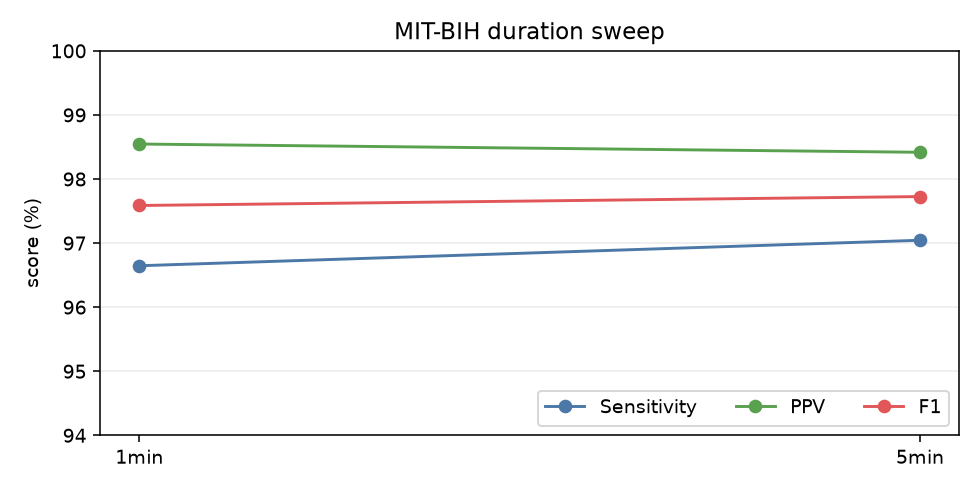

بدترین رکوردهای ۶۰ ثانیه اول از نظر FP عبارت‌اند از:

| رکورد | FP | FN | Se | PPV | F1 |
|---|---:|---:|---:|---:|---:|
| 208 | 8 | 13 | 88.29٪ | 92.45٪ | 90.32٪ |
| 117 | 7 | 1 | 98.04٪ | 87.72٪ | 92.59٪ |
| 232 | 7 | 2 | 96.61٪ | 89.06٪ | 92.68٪ |
| 207 | 7 | 22 | 77.32٪ | 91.46٪ | 83.80٪ |
| 113 | 4 | 1 | 98.31٪ | 93.55٪ | 95.87٪ |

این جدول برای دفاع پایان‌نامه مهم است، زیرا نشان می‌دهد میانگین کلی به‌تنهایی گزارش نشده و رکوردهای سخت نیز مشخص شده‌اند.

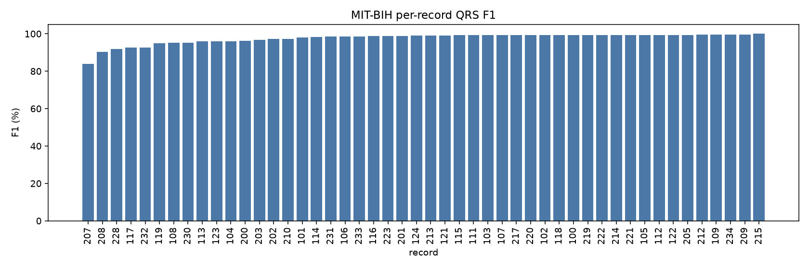

## ۴-۱۸ مقایسه detectorها

برای مقایسه علمی‌تر، سه detector روی MIT-BIH 60s مقایسه شدند:

1. `pan_tompkins_baseline`
2. `current`
3. `hamilton_style`

جدول ۴-۵ نتیجه را نشان می‌دهد.

| Detector | Se | PPV | F1 | Runtime ms/min ECG |
|---|---:|---:|---:|---:|
| Pan-Tompkins baseline | 89.91٪ | 99.91٪ | 94.65٪ | 17.73 |
| Current detector | 96.65٪ | 98.55٪ | 97.59٪ | 4.95 |
| Hamilton-style | 96.70٪ | 96.67٪ | 96.69٪ | 4.16 |

در این مقایسه، detector فعلی بهترین F1 را دارد. baseline ساده PPV بسیار بالا دارد، اما sensitivity پایین‌تری دارد و تعداد missed beat بیشتری تولید می‌کند. detector Hamilton-style نزدیک به detector فعلی است، اما PPV پایین‌تری دارد. بنابراین انتخاب detector فعلی در این پروژه قابل دفاع است.

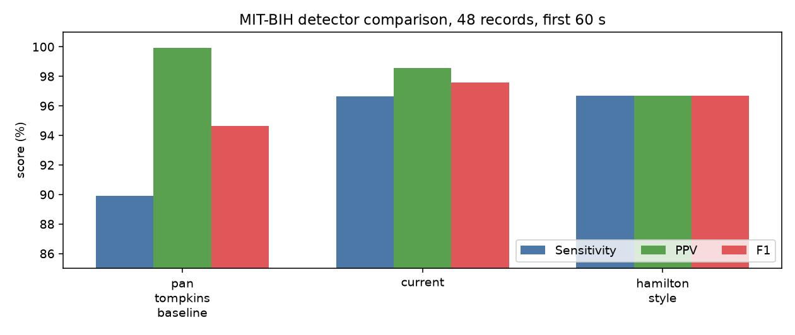

## ۴-۱۹ ارزیابی QTDB برای fiducialها

برای ارزیابی P/R/T از QT Database استفاده شد. ماژول `fiducials.py` annotationهای waveform را parse می‌کند. در QTDB، P، QRS peak و T annotate می‌شوند، اما Q و S به‌عنوان قله مستقل annotate نمی‌شوند. بنابراین Q و S فقط در برابر QRS onset و QRS offset به‌صورت approximate boundary سنجیده شدند.

نتیجه aggregate روی ۱۰۵ رکورد محلی QTDB در جدول ۴-۶ آمده است.

| Marker | Mean coverage | Mean MAE |
|---|---:|---:|
| P | 91.2٪ | 19.09 ms |
| R | 99.9٪ | 8.28 ms |
| T | 94.6٪ | 39.18 ms |
| Q در برابر QRS onset | 99.9٪ | 26.80 ms |
| S در برابر QRS offset | 99.9٪ | 24.65 ms |

تحلیل این نتایج نشان می‌دهد R دقیق‌ترین marker است. P عملکرد متوسط و قابل قبول دارد، اما T همچنان ضعیف‌ترین بخش morphology است. با وجود این، نسبت به نسخه قبلی، T coverage و MAE بهتر شده است. علت اصلی دشواری T این است که T دامنه کمتر و شکل متغیرتری دارد و در سیگنال تک‌لید، مرز آن به نویز و baseline wander حساس است.

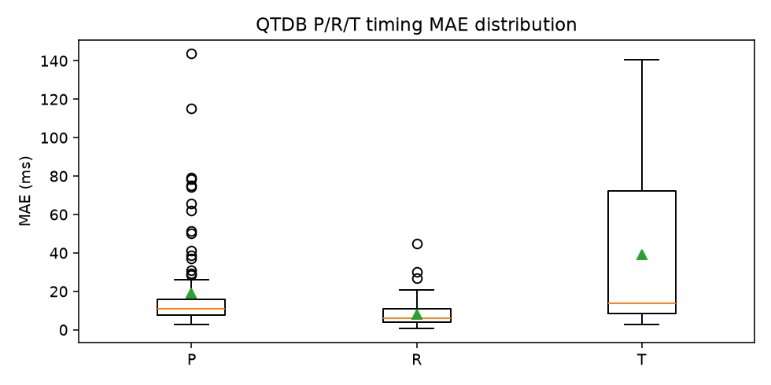

## ۴-۲۰ ارزیابی NSTDB و رفتار SQI در نویز

برای بررسی robustness در برابر نویز از MIT-BIH Noise Stress Test Database استفاده شد. رکوردها از SNR 24dB تا -6dB بررسی شدند. جدول ۴-۷ خلاصه نتایج را نشان می‌دهد.

| رکورد | SNR | میانگین SQI | پنجره‌های PQRST-usable | QRS تشخیص‌داده‌شده |
|---|---:|---:|---:|---:|
| 118e24 | 24dB | 0.681 | 5/6 | 75 |
| 118e18 | 18dB | 0.645 | 4/6 | 78 |
| 118e12 | 12dB | 0.506 | 1/6 | 83 |
| 118e06 | 6dB | 0.450 | 0/6 | 95 |
| 118e00 | 0dB | 0.510 | 1/6 | 94 |
| 118e_6 | -6dB | 0.521 | 1/6 | 84 |

نتایج نشان می‌دهد با افزایش نویز، مسیر morphology به‌تدریج محدود می‌شود. در نویز شدید، سامانه هنوز ممکن است QRS/HR را قابل استفاده بداند، اما P/T را غیرقابل اعتماد علامت می‌زند. این رفتار برای یک سامانه کم‌هزینه مناسب است، زیرا به‌جای تولید markerهای ظاهراً دقیق اما غیرقابل اعتماد، سطح تحلیل را کاهش می‌دهد.

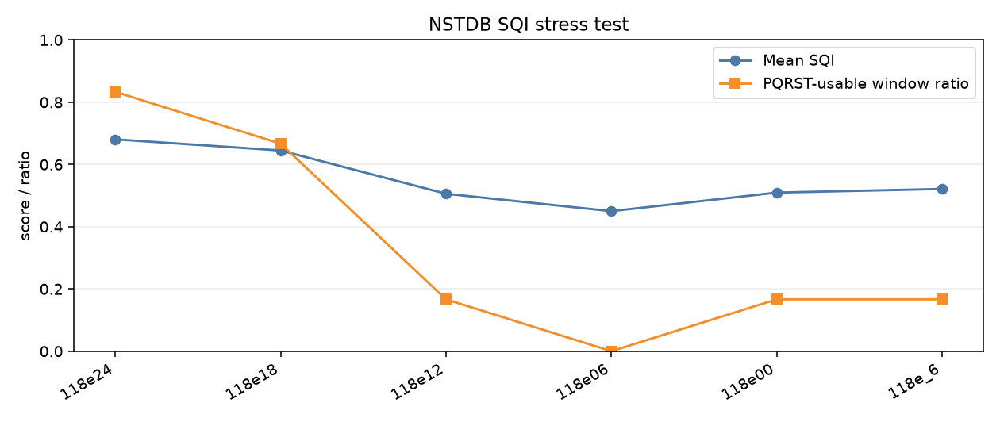

## ۴-۲۱ ارزیابی log سخت‌افزار و معیارهای acquisition

اسکریپت `scripts/evaluate_realtime_log.py` برای تحلیل logهای AD8232 نوشته شد. این اسکریپت فایل CSV ثبت‌شده را می‌خواند و معیارهای acquisition و تحلیل را محاسبه می‌کند. علاوه بر آن، اسکریپت `scripts/analyze_real_ad8232_sessions.py` برای مقایسه دو رکورد واقعی نهایی اضافه شد.

در نسخه نهایی دو رکورد واقعی با Arduino و AD8232 ثبت شد. رکورد اول مربوط به خانم ۲۳ ساله و رکورد دوم مربوط به آقای ۲۴ ساله است. در هنگام ثبت واقعی، بخشی از سیگنال‌ها به دلیل جابه‌جایی دستگاه، تماس نامناسب الکترود یا artifact حرکتی کیفیت کافی برای تحلیل morphology نداشتند. بنابراین در گزارش نهایی، تحلیل PQRST فقط روی سالم‌ترین پنجره‌های ۶ ثانیه‌ای انجام شد و بخش‌های خراب از نمودارهای markerگذاری‌شده و جدول intervalها حذف شدند.

انتخاب پنجره سالم با stride یک ثانیه انجام شد. هر پنجره بر اساس SQI، نبود lead-off، نرخ clipping، پایداری RR، تعداد R-peak کافی و کامل بودن markerهای P/Q/R/S/T امتیاز گرفت. این روش باعث می‌شود شکل‌های PQRST به بخش‌هایی محدود شوند که سیگنال از نظر مهندسی قابل اتکا است، نه بخش‌هایی که فقط از نظر زمانی در رکورد وجود دارند.

خلاصه کل دو رکورد:

| فرد | مدت | نمونه معتبر | نرخ نمونه‌برداری | packet loss | checksum error | clipping | SQI | HR میانگین |
|---|---:|---:|---:|---:|---:|---:|---|---:|
| خانم ۲۳ ساله | 130.64s | 32662 | 250.000Hz | 0.00٪ | 0 | 0.67٪ | `usable_for_pqrst` (0.80) | 79.48 bpm |
| آقای ۲۴ ساله | 246.28s | 61570 | 250.000Hz | 0.00٪ | 0 | 0.74٪ | `usable_for_pqrst` (0.94) | 78.06 bpm |

نتایج acquisition نشان می‌دهد هر دو رکورد از نظر ارتباط سریال سالم هستند: packet loss صفر، checksum error صفر و lead-off صفر ثبت شد. نرخ نمونه‌برداری هر دو رکورد تقریباً دقیقاً ۲۵۰Hz بود. بنابراین زنجیره Arduino، packet parser و ثبت raw data در GUI به‌درستی کار کرده است.

جدول زیر نتیجه تحلیل فقط روی بازه‌های سالم منتخب را نشان می‌دهد. مقدار P-R در این جدول فاصله قله P تا قله R است و معادل PR interval بالینی کامل نیست. همچنین QRS، QT و QTc به‌دلیل تک‌لید بودن AD8232، نویز حرکتی و نبود مرجع پزشکی، فقط تخمین آموزشی و غیرتشخیصی هستند.

| فرد | بازه سالم | زمان | HR | RR CV | SDNN | RMSSD | P-R peak | QRS | QT | QTc | SQI | خروجی rule-based |
|---|---|---:|---:|---:|---:|---:|---:|---:|---:|---:|---|---|
| خانم ۲۳ ساله | بازه سالم ۱ | 24.0-30.0s | 72.70 bpm | 0.024 | 19.4ms | 27.1ms | 120.0ms | 52.6ms | 266.9ms | 294.3ms | `usable_for_pqrst` (0.75) | Normal rhythm candidate |
| خانم ۲۳ ساله | بازه سالم ۲ | 18.0-24.0s | 75.06 bpm | 0.030 | 23.6ms | 30.8ms | 124.0ms | 52.6ms | 269.1ms | 300.9ms | `usable_for_pqrst` (0.74) | Normal rhythm candidate |
| آقای ۲۴ ساله | بازه سالم ۱ | 132.0-138.0s | 77.26 bpm | 0.010 | 8.1ms | 14.4ms | 123.0ms | 121.5ms | 326.9ms | 371.0ms | `usable_for_pqrst` (0.83) | Low preliminary rhythm warning |
| آقای ۲۴ ساله | بازه سالم ۲ | 77.0-83.0s | 73.58 bpm | 0.013 | 10.3ms | 11.9ms | 119.4ms | 108.5ms | 301.7ms | 334.8ms | `usable_for_pqrst` (0.82) | Normal rhythm candidate |

در رکورد خانم ۲۳ ساله هر دو بازه سالم انتخاب‌شده HR حدود ۷۳ تا ۷۵ bpm، RR CV پایین و visibility کامل برای P/Q/R/S/T داشتند. در رکورد آقای ۲۴ ساله نیز دو بازه سالم با packet flow پایدار و SQI قابل استفاده انتخاب شد. یکی از بازه‌های آقای ۲۴ ساله هشدار rule-based سطح پایین گرفت، اما چون این سامانه تشخیصی نیست، این خروجی فقط به‌عنوان رفتار الگوریتم روی RR و morphology همان پنجره گزارش می‌شود. بخش‌هایی که شبیه artifact جابه‌جایی دستگاه بودند، مانند افت‌وخیز شدید baseline یا جهش‌های بزرگ غیرقلبی، در تحلیل PQRST نهایی استفاده نشدند.


## ۴-۲۲ آزمایش ML اکتشافی

ML در این پروژه نقش اصلی ندارد و فقط برای مقایسه آموزشی اضافه شده است. مسیر اصلی هشدارها rule-based است. ML با SQI پایین suppress می‌شود و هیچ‌وقت خروجی rule-based را override نمی‌کند.

دو حالت ML وجود دارد:

1. synthetic feature table؛
2. MIT-BIH patient-wise DS1/DS2.

در حالت synthetic، مسیر train/evaluate فقط سلامت feature extraction و model wrapper را نشان می‌دهد. نتیجه holdout synthetic:

| معیار | مقدار |
|---|---:|
| Accuracy | 100٪ |
| Macro F1 | 100٪ |
| Weighted F1 | 100٪ |
| AUROC | 100٪ |

این عددها اعتبار بالینی ندارند، زیرا داده synthetic ساده است.

در حالت MIT-BIH، تقسیم patient-wise انجام شده است تا نشت بیمار بین train و test رخ ندهد. اجرای موجود کاهش‌یافته و نامتوازن است:

| بخش | مقدار |
|---|---:|
| Train samples | 278 |
| Test samples | 288 |
| Test normal-like | 287 |
| Test warning-like | 1 |
| Accuracy | 99.65٪ |
| Macro F1 | 49.91٪ |
| Weighted F1 | 99.48٪ |

به دلیل وجود فقط یک نمونه warning-like در test، این نتیجه unstable علامت‌گذاری شده است. بنابراین از آن فقط به‌عنوان proof-of-mechanism استفاده می‌شود، نه نتیجه معتبر آریتمی.

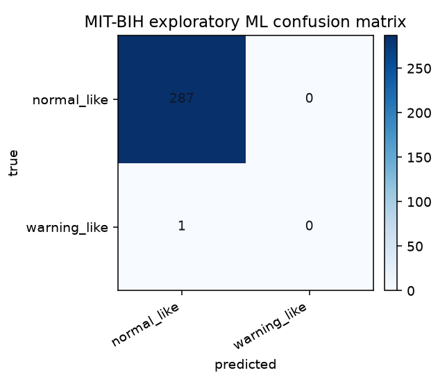

## ۴-۲۳ تست‌ها و صحت‌سنجی نرم‌افزار

برای کنترل regression، تست‌های واحد و تست‌های اسکریپت اجرا شدند. دستورهای اصلی:

```bash
python3 -m py_compile ecg_monitor/*.py scripts/*.py
python3 -m pytest tests/test_ecg_pipeline.py tests/test_gui.py tests/test_realtime_log.py tests/test_qtdb_fiducials.py -q
.venv/bin/python -m unittest discover -s tests -v
```

نتایج:

| دستور | نتیجه |
|---|---|
| compile همه ماژول‌ها | موفق |
| pytest focused | 50 passed |
| unittest کامل با venv | 71 tests OK |

تست‌ها بخش‌های زیر را پوشش می‌دهند:

- parser سریال و checksum؛
- packet loss و jitter؛
- فیلترگذاری و حفظ طول سیگنال؛
- تشخیص R روی synthetic؛
- جلوگیری از double detection ناشی از T-wave؛
- P/T suppression در SQI پایین؛
- SQI hard rejection؛
- warning logic؛
- GUI analysis و replay source؛
- QTDB parser و marker matching؛
- NSTDB noise metrics؛
- real-time log evaluator؛
- ML wrapper و patient-wise split.

## ۴-۲۴ جمع‌بندی فصل

در این فصل پیاده‌سازی کامل سامانه توضیح داده شد. سامانه از نظر سخت‌افزاری شامل AD8232 و Arduino است و از نظر نرم‌افزاری شامل parser مقاوم، فیلتر دوشاخه، QRS detector، PQRST delineation، SQI چهارسطحی، هشدارهای rule-based، GUI dashboard، replay mode، scenario mode، detector comparison، ارزیابی dataset و گزارش HTML است.

نتایج نشان دادند که detector فعلی روی MIT-BIH عملکرد مناسبی دارد و پس از کاهش FP، PPV به ۹۸٫۵۵٪ در ۶۰ ثانیه اول و ۹۸٫۴۲٪ در ۵ دقیقه اول رسید. QTDB نشان داد R بسیار دقیق است، P قابل قبول است و T همچنان چالش‌برانگیزترین fiducial باقی می‌ماند. NSTDB نشان داد SQI با افزایش نویز مسیر morphology را محدود می‌کند. سناریوهای synthetic نیز رفتار مورد انتظار را با نرخ پاس ۱۰۰٪ نشان دادند.

بنابراین پروژه از مرحله «نمایش ساده ECG» عبور کرده و به یک سامانه آموزشی قابل دفاع تبدیل شده است که هم خروجی تولید می‌کند، هم سطح اعتماد خروجی را مشخص می‌کند، هم موارد غیرقابل اعتماد را suppress می‌کند و هم نتایج خود را با داده‌های استاندارد و گزارش خودکار مستند می‌سازد.
