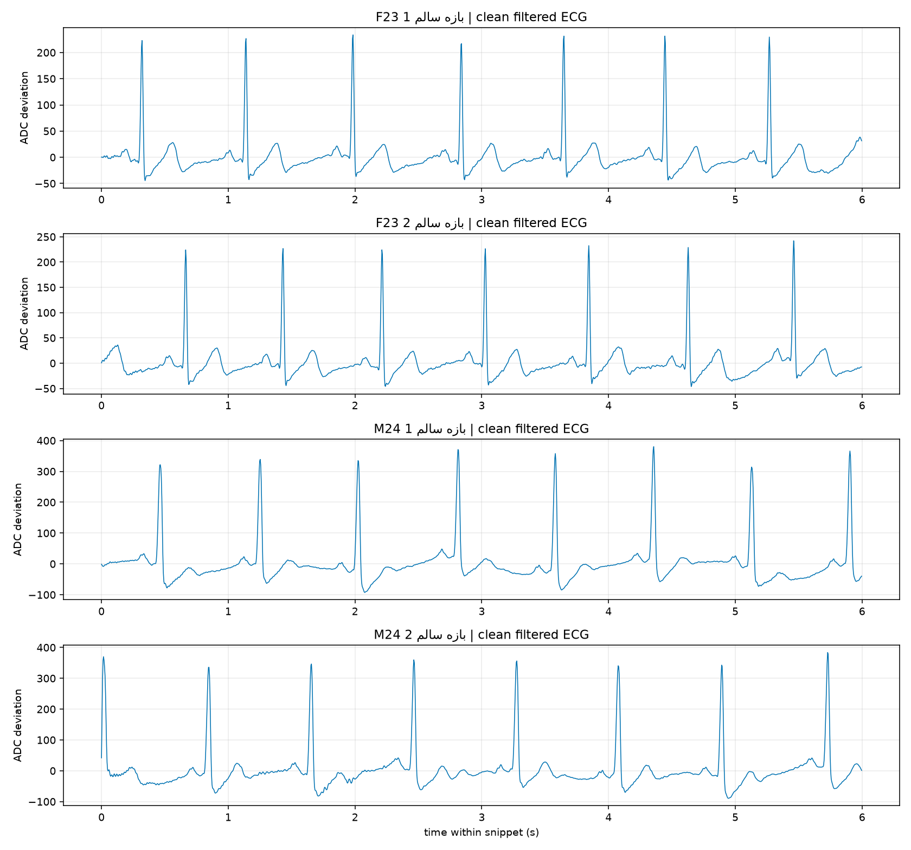
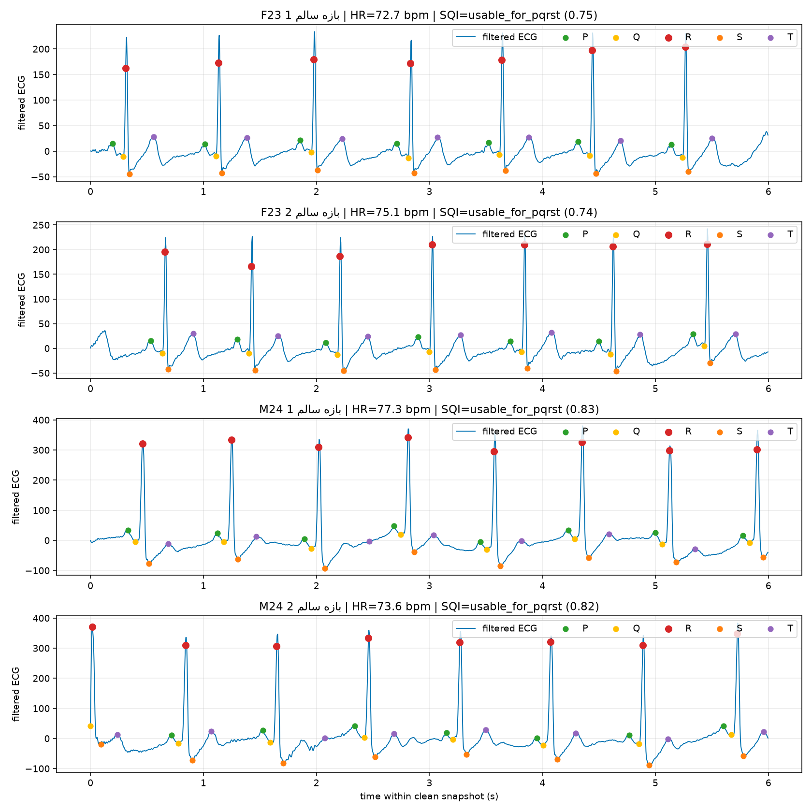
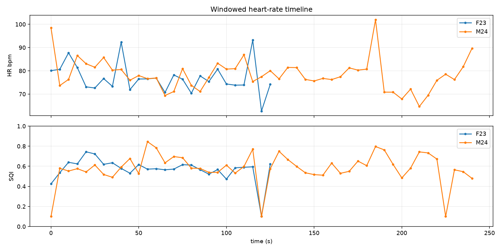
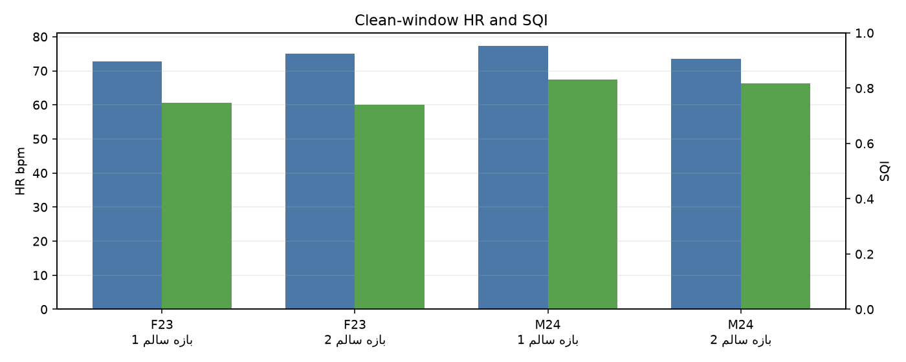
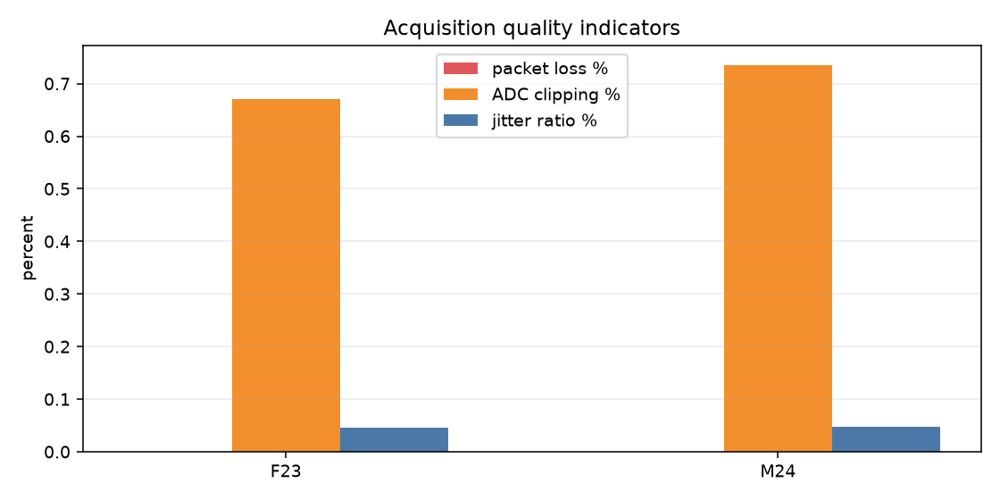

# گزارش نهایی مقایسه دو رکورد واقعی AD8232

این گزارش آموزشی و غیرتشخیصی است و برای تشخیص پزشکی یا تصمیم درمانی استفاده نمی‌شود.

روش تحلیل: تکه‌های دارای جابه‌جایی دستگاه، clipping زیاد، SQI پایین یا RR ناپایدار از تحلیل تصویری حذف شدند. جدول‌های زیر فقط بر اساس سالم‌ترین بازه‌های ۶ ثانیه‌ای منتخب هر رکورد هستند.

## خلاصه کل رکوردها

| فرد | مدت | نمونه معتبر | نرخ نمونه‌برداری | packet loss | checksum error | clipping | SQI | HR میانگین | هشدار غیرتشخیصی |
|---|---:|---:|---:|---:|---:|---:|---|---:|---|
| خانم ۲۳ ساله (F23) | 130.64s | 32662 | 250.000Hz | 0.00% | 0 | 0.67% | usable_for_pqrst (0.80) | 79.48 | Moderate preliminary rhythm warning |
| آقای ۲۴ ساله (M24) | 246.28s | 61570 | 250.000Hz | 0.00% | 0 | 0.74% | usable_for_pqrst (0.94) | 78.06 | Low preliminary rhythm warning |

## تحلیل بازه‌های سالم منتخب

| فرد | بازه سالم | زمان | HR | RR CV | SDNN | RMSSD | P-R peak | QRS | QT | QTc | P/Q/S/T visibility | SQI | خروجی rule-based |
|---|---|---:|---:|---:|---:|---:|---:|---:|---:|---:|---:|---|---|
| خانم ۲۳ ساله (F23) | بازه سالم 1 | 24.0-30.0s | 72.70 | 0.024 | 19.4ms | 27.1ms | 120.0ms | 52.6ms | 266.9ms | 294.3ms | P 100.00%, Q 100.00%, S 100.00%, T 100.00% | usable_for_pqrst (0.75) | Normal rhythm candidate |
| خانم ۲۳ ساله (F23) | بازه سالم 2 | 18.0-24.0s | 75.06 | 0.030 | 23.6ms | 30.8ms | 124.0ms | 52.6ms | 269.1ms | 300.9ms | P 100.00%, Q 100.00%, S 100.00%, T 100.00% | usable_for_pqrst (0.74) | Normal rhythm candidate |
| آقای ۲۴ ساله (M24) | بازه سالم 1 | 132.0-138.0s | 77.26 | 0.010 | 8.1ms | 14.4ms | 123.0ms | 121.5ms | 326.9ms | 371.0ms | P 100.00%, Q 100.00%, S 100.00%, T 87.50% | usable_for_pqrst (0.83) | Low preliminary rhythm warning |
| آقای ۲۴ ساله (M24) | بازه سالم 2 | 77.0-83.0s | 73.58 | 0.013 | 10.3ms | 11.9ms | 119.4ms | 108.5ms | 301.7ms | 334.8ms | P 87.50%, Q 100.00%, S 100.00%, T 100.00% | usable_for_pqrst (0.82) | Normal rhythm candidate |

## تفسیر مهندسی

- هر دو رکورد از نظر acquisition سالم هستند: packet loss و checksum error صفر است و lead-off ثبت نشده است.
- رکورد خانم ۲۳ ساله حدود ۱۳۰٫۶ ثانیه و رکورد آقای ۲۴ ساله حدود ۲۴۶٫۳ ثانیه طول دارد؛ هر دو با نرخ تقریباً دقیق ۲۵۰Hz ثبت شده‌اند.
- SQI کل هر دو رکورد در سطح قابل استفاده برای PQRST قرار گرفت، اما برای شکل‌ها و تحلیل PQRST فقط سالم‌ترین پنجره‌ها استفاده شد.
- شاخص‌های P-R peak، QRS، QT و QTc تقریبی هستند، چون markerها از ECG تک‌لید و الگوریتم آموزشی استخراج شده‌اند، نه از annotation پزشکی.
- خروجی rhythm همچنان غیرتشخیصی و rule-based است. اگر warning دیده شود، به معنی تشخیص آریتمی نیست؛ فقط رفتار الگوریتم روی RR و markerهای همان بازه را نشان می‌دهد.
- بخش‌های خراب ناشی از جابه‌جایی دستگاه از نمودارهای PQRST حذف شده‌اند.

## نمودارها

